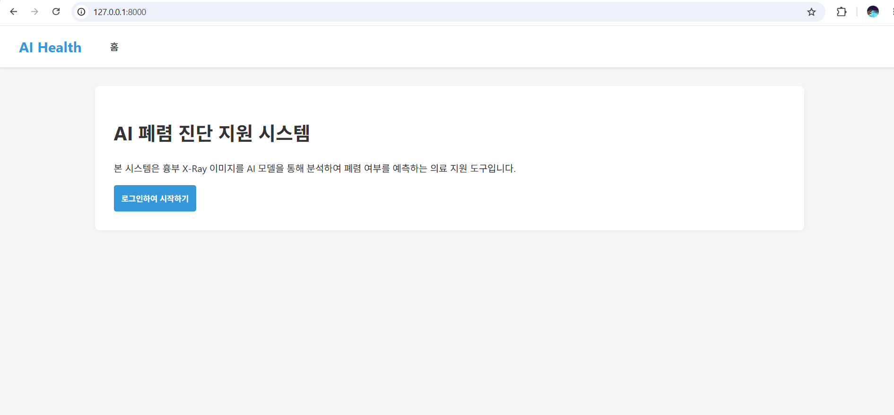

# 🚀 7일차 과제: 앱 실행 화면 및 엔드포인트 동작 설명

이번 과제에서는 FastAPI 백엔드 서버와 프론트엔드 템플릿을 연결하고, 각 엔드포인트가 정상적으로 동작하는지 확인했습니다.

---

## 1. 메인 / 로그인 화면 (http://127.0.0.1:8000)
- **설명**: AI 폐렴 진단 지원 시스템의 첫 화면으로, 로그인 버튼을 통해 시스템에 접근할 수 있습니다.
- **실행 화면**:
  - 